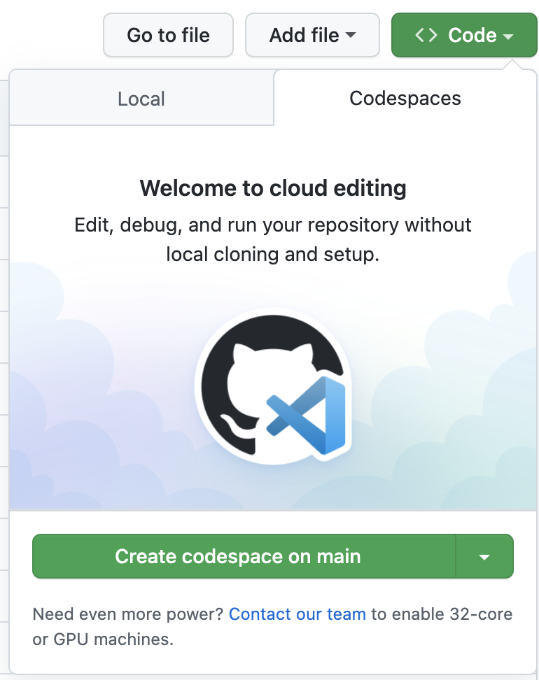
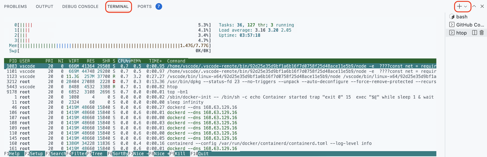

# 前日までに準備するもの

1. 下記リンクからgithubのCodespaces Betaを申請しておく
  * https://github.com/features/codespaces/signup
  * *有効になるまで審査期間要するので必ず事前に済ませておきましょう*

2. 本リポジトリをフォークしておく

3. VSCodeにGithub Codespacesの拡張をインストールし、ログインしておく
  * https://marketplace.visualstudio.com/items?itemName=GitHub.codespaces

# 当日に準備するもの
## Codespacesの利用方法
フォークした各自のリポジトリにて、下記の手順でCodeSpaceを立ち上げる。

- `Code`ボタンをクリック
- `Codespaces`タブをクリック
- `Create codespace on main`をクリック

Codespaceが立ち上げてから、環境が整うまで少し時間がかかるので

**ハンズオンの開始前の15分前くらいに立ち上げてくださいー**

事前にVSCodeにGithub Codespacesの拡張をインストールし、ログインしていれば、
`Open this codespace in VS Code Desktop`をクリックしてVSCodeで接続してください。

## Codespacesを延命させる

通常、Codespacesを立ち上げて、30分放置すればインスタンスが落とされる

ハンズオン中、またはハンズオン後みんなが復習する時に、下記の手順でインスタンスを落とされないようにする

- `Terminal`タブをクリック
- `+`ボタンをクリック
- `htop`コマンドを実行

